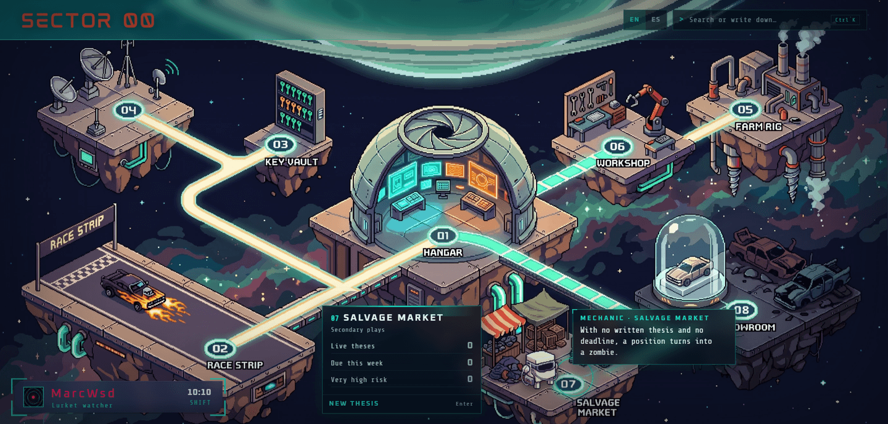
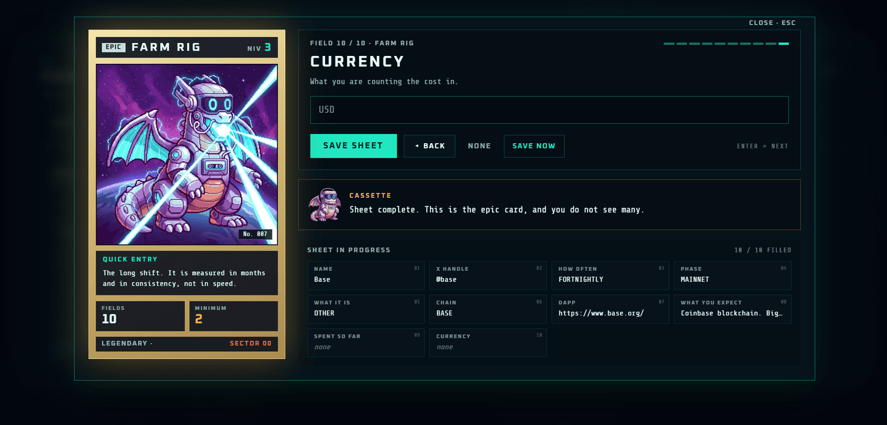
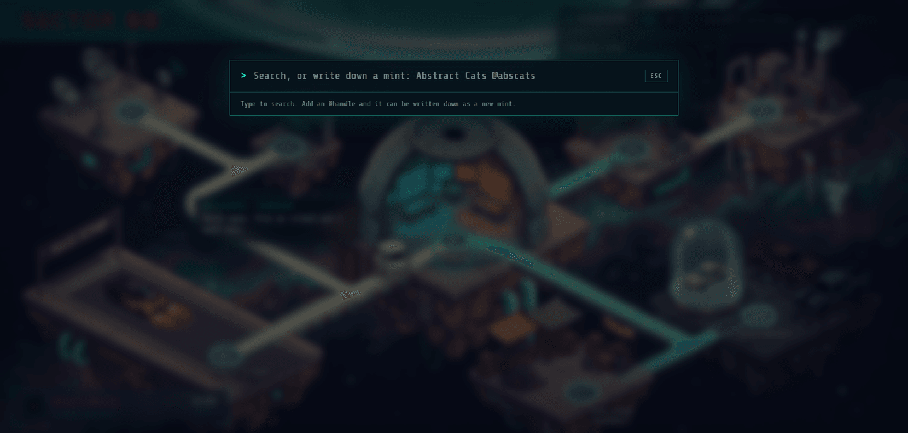
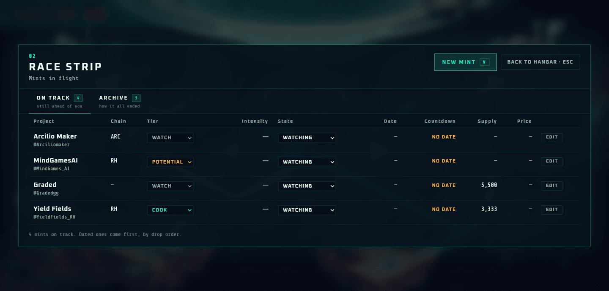
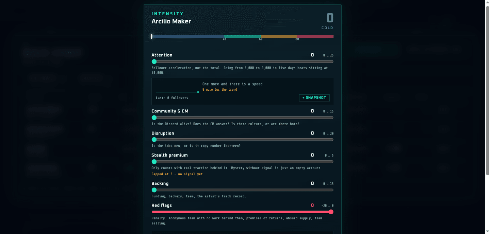
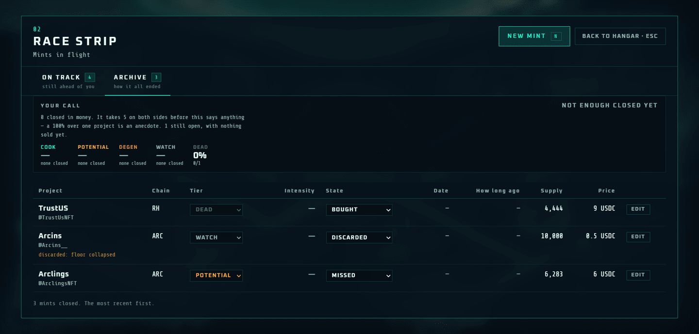
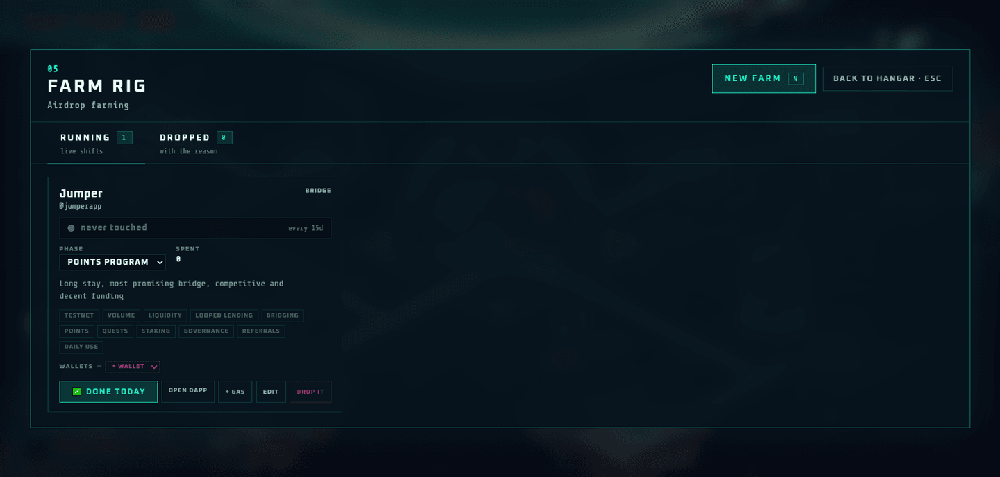
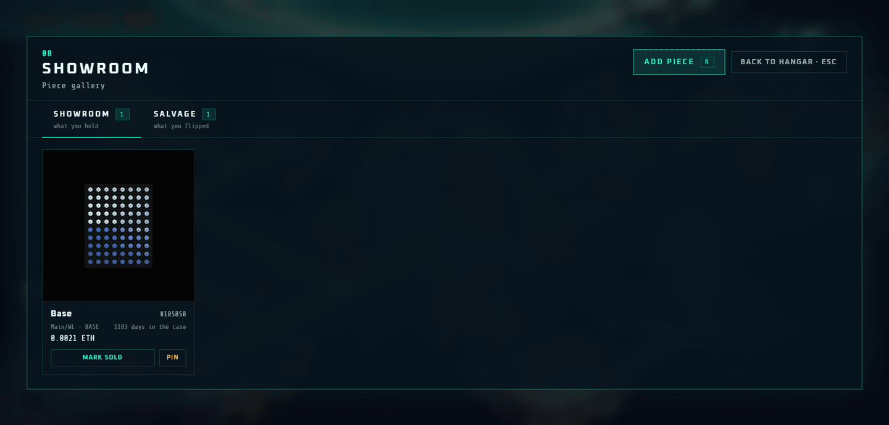

# SECTOR 00

**A crypto operations board that looks like a game and works like a tool.**

Mints, whitelists, wallets, airdrops and secondary plays — tracked on a hand-painted
pixel-art space station, one island per job. It runs entirely on your own machine.
Nothing leaves it.

 

---

> **This repository is the product showcase.** The source code lives in a private
> repository; what you will find here is the description and the screenshots.

---

## What it replaces

A spreadsheet. The one where you track which mint is tomorrow, which wallet holds the
whitelist, what you paid and whether it was worth it. It works until it doesn't: a
spreadsheet can't tell you a whitelist expires in four hours, can't hold two whitelists
of the same project on the same wallet, and can't stop you from typing `0.1 + 0.2` and
getting `0.30000000000000004` in a column that represents money.

But a spreadsheet is only half of what it replaces. **The other half is the noise.**

A Discord alpha group drops thirty projects a week. Maybe three are for you. The rest are
somebody else's taste, somebody else's thesis, somebody else's bag — and they arrive in
the same feed, at the same volume, with the same urgency. The filter that decides which of
the thirty is worth your wallet is yours, and it lives in your head, where it does you no
good at 2am.

**SECTOR 00 is where that filter becomes a thing you can see** — and, eventually, a thing
you can audit. A project gets a **tier** the moment you write it down, an **intensity**
score built from six explicit controls, and months later the board compares both against
what actually happened to your money.

So: a spreadsheet rebuilt as an instrument, and a feed rebuilt as a shortlist.

## One person, not a community

This is not a platform with a feed, and not a server where everyone sees the same list.
**It is your board, on your machine, with your judgement.** Nobody sees your wallets,
nobody knows which projects you are in, and there is no account to create. The entire
database is one file on your disk.

That decision is not technical, it is product: what you write down is your edge, and an
edge shared by default stops being one.

---

## Why it is a card

Because the real problem with a watchlist is not forgetting to write in it. It is writing
half of it and never coming back.

So the form **is a collectible card that evolves while you fill it**:

- **LV 1 · BASIC** — two fields and the project exists. The baby stage. That is not a
  failing grade, it is the point: when a mint drops at 2am, what you need is to write it
  down in five seconds.
- **LV 2 · EVOLVED** — past the halfway mark of the sheet.
- **LV 3 · EPIC** — the sheet **complete**. The card launches, spins three times in the
  air — once per level — lands with a bounce and settles with a golden halo.

And when a field does not apply — many projects have no Discord, a free mint has no price —
you press **N/A** and it counts as resolved. Deciding that nothing goes there *is*
deciding, and it is different from leaving it blank, which means "I don't know yet".
Without that, a project with no Discord could never reach epic, and an impossible goal
does not motivate — it discourages.

Every island has its own card with its own serial number. They are a collection.

<b>The epic card</b> · it shows up on its own when the sheet is complete. There is no button that summons it.

---

## The hangar

The home screen is a hand-painted pixel-art space station: **eight floating islands, one
job each**, connected by light walkways. Navigate with the mouse or the arrow keys, and a
mechanic walks over to whichever island you select and tells you what it is for.

The pulses travelling along the walkways are not decoration: they move toward whatever
needs attention, so a warning can be read without reading. And the mask they travel
through is extracted from the artwork itself by asking it for pixels by colour — there is
not one extra art file for it.

## Three doors for the same data

Because what decides whether a piece of data exists at all is what it costs to write it
down:

| Door | When | Cost |
|---|---|---|
| **Console** (`Ctrl+K`) | A mint drops in Discord at 2am | One line: `Abstract Cats @abscats` → Enter |
| **The card wizard** | You sit down with time | One field at a time, each one explained |
| **Edit** | A detail changed | Every field at once, no ceremony |

The wizard explains as it goes — *"OG and GTD guarantee a spot. FCFS and RAFFLE do not:
one is a race, the other a lottery."* That is the difference between filling a form and
understanding what you are filling.

<b>The console</b> · 70% of real use. One line, Enter, and the project exists. It searches projects and wallets at the same time.

---

## The eight islands

| | | |
|---|---|---|
| **01 · HANGAR** | The board itself | What needs doing today, and what is heating up |
| **02 · RACE STRIP** | Mints, in two views | **ON TRACK** is what is still ahead of you; **ARCHIVE** is what already closed |
| **03 · KEY VAULT** | Whitelists | A wallet can hold several keys for the same project; each phase can cost a different price |
| **04 · SIGNAL ARRAY** | Other people's wallets | **Public addresses and labels only.** Each one carries a required *why you follow it* and a manual hit/miss counter |
| **05 · FARM RIG** | The long shift | Measured in months and consistency, not speed |
| **06 · WORKSHOP** | Links, by drawer | Answers one question: *where was that bridge?* |
| **07 · SALVAGE MARKET** | Secondary plays | Two required questions no other island asks: *why it interests you* and *until when* |
| **08 · SHOWROOM / SALVAGE** | Pieces, held and sold | The result card, and what the flip actually did |

<b>02 · RACE STRIP</b> · the line between live and archived is <b>the state, never the date</b>. A mint whose day passed but that you never resolved is not finished — it is <i>pending</i>, and hiding it by age would bury a decision.

---

## The part that is not a CRUD

Three systems turn a record into a judgement. They were built in this order on purpose:
**the tachometer makes the number, the snapshots make it move, and the scoreboard decides
whether your judgement is worth anything.**

### The tachometer — the filter made visible

A number from 0 to 100 that **you never type**. It comes out of six explicit controls, and
explicit is the whole point: *"I like it a lot, call it 85"* cannot be repeated, argued
with, or reviewed six months later. Six boxes can. When one of your 90s ends at zero, you
can look at which of the six lied to you.

**Two rules make it more than a number field:**

- **Five in the red zone and not one more.** It is the only rule on the board that forces
  you to *take something away*. Nothing stops you giving 90 to twelve projects, and twelve
  priorities are zero priorities. Attention is a finite resource and this is the mechanic
  that makes it visible — to add a sixth you have to lower another, which is exactly the
  decision you otherwise never make.
- **The stealth premium is conditional.** Stealth only counts with traction behind it. An
  account with three words and strong art that fifteen big accounts follow is stealth; an
  account with three words and nobody watching is an empty account. Without this gate,
  *"nobody knows anything about them"* would be fifteen free points — the most expensive
  mistake in this game: mistaking mystery for signal.

The sum is recomputed **server-side** and never accepted from the browser. That is the only
thing stopping the red-zone cap from being bypassed by sending a 79 with every control
maxed. A limit you can dodge with a hand-written request is not a limit.

### Snapshots — velocity, not volume

The follower count tells you where a project **is**, not where it is **going**. One sitting
at 40,000 and one that went from 2,000 to 9,000 in five days look identical in any
spreadsheet, and have nothing in common.

So the history is stored, not a single number. Fifteen seconds, once a week:

| Snapshots | What appears |
|---|---|
| 1 | Nothing yet. *"One more and there is a speed."* |
| 2 | **Velocity** — new followers per day, plus the sparkline |
| 3 | **Trend** — SPEEDING UP · STEADY · SLOWING DOWN |

The third one is the one that pays. With two points you know the pace; with three you know
whether the pace is **changing** — and the case that matters is not the one that grows, it
is the one that **still grows but less each week**. The total says "doing fine" and the
acceleration says "burning out".

### Your call — the board grading you

The tier is a prediction you made the day you wrote the project down, before knowing how it
would end. Months later the piece is sold and there is a number. Comparing the two is the
only thing that turns the tier into a tool instead of a label.

<b>It refuses to judge on thin data</b>, and that is deliberate. A 100% over one project is an anecdote, and a verdict this blunt — <i>"your judgement is not helping"</i> — has no business being handed out over noise.

Once there is enough on both sides, it says one of three things. The third is the one that
pays for everything else: **YOUR TIER IS UPSIDE DOWN** — your throwaway bets beat the ones
you believed in. That does not surface on its own, and it changes how you pick.

---

## The long shift

<b>05 · FARM RIG</b> · the consistency light. Green while you keep your interval, amber the moment you slip, red at double. What is overdue goes on top. <b>It is the only pressure the system applies, and it is enough</b> — a second source of guilt would teach you to ignore both.

## The result

<b>08 · SHOWROOM</b> · the result card, with its two frames and four cells: BUY · SELL · PnL · TIME. <b>You never pick the frame — the number picks it.</b> TIME is what completes the judgement: 0.37 ETH in forty days and 0.37 ETH in eight months are not the same trade.

What this card deliberately **does not** show is *"what it would be worth today"*. Reminding
someone that they sold early is digging at a past they cannot change. The current floor is
only shown on pieces still held, where it is not a reproach but the value of something that
is still yours.

---

## Non-negotiable

**No private keys. No seed phrases. Ever.** Public addresses and labels only. The
application does not sign and does not execute transactions. There is no wallet
connection, because there is nothing to connect.

- **No floating point for money.** Decimals are stored as text and compared as integers.
  A `0.1 + 0.2` in a wallet is an accounting error that does not announce itself.
- **Timestamps are UTC integer milliseconds.** Local time exists only at the moment of
  painting it on screen.
- **Addresses live in two columns:** one keeps the casing — which on an EVM chain is the
  checksum and on Solana is part of the address — and the lowercase one is the only one
  used to search and compare.
- **Nothing is deleted.** Discarded records change state and keep the reason. A discard
  with no reason, six months later, is worth exactly as much as never having written it
  down.

  With **two exceptions, both reasoned**: workshop links and radar wallets. A bridge that
  shut down has no story to tell. The clearest case is **faucets**: a chain goes to mainnet
  and its testnet tap stops existing — the link did not break, the project changed stage.
  That `DELETE` appears exactly twice across eight islands is the signal that the rule is
  still alive.

Your data is a single SQLite file on your disk. No account, no cloud, no telemetry.

---

## Architecture

> **Two layers, one truth: the canvas draws the world, the DOM draws the instrument.**

The background, the mechanic and the effects are images. The tables, the figures, the forms
and the labels are real DOM: selectable, alignable, accessible text. **No number is ever
painted inside an image.**

The two layers do not share a coordinate system, and that is on purpose. The **world** is
positioned in pixels of a fixed 1920 × 1072 canvas and anchored to the artwork. The
**instrument** is anchored to the window. They took the same scale for a while and it cost
a rewrite: the top bar occupied the canvas's first 88 px and the operator plate the last
84, so cropping the scene to fill the screen cut both off.

**One validation schema, not two.** The same Zod object validates the form in the browser
and the request body on the server. One definition of what is valid, instead of two that
drift apart in three months.

**Bilingual, and neither language is a translation of the other.** English by default,
Spanish on request. The jargon stays in English in both — *mint*, *whitelist*, *floor*,
*airdrop*, *tier* — because that is where the vocabulary comes from. Both strings are
written side by side at the point of use, so there is no orphan key and no translation that
goes stale.

## Stack

| | |
|---|---|
| **Interface** | React 19 · TypeScript 7 · Vite 8 · TanStack Query and Table · React Hook Form |
| **Server** | Fastify 5 · Drizzle ORM · SQLite (`better-sqlite3`, WAL mode) |
| **Shared** | Zod 4 — the same contracts on both sides · `dnum` for decimals |
| **Quality** | Vitest · Biome |
| **Art** | Own pixel art, exported to WebP by a `sharp` script |

A modular monolith with a single `package.json` and a vertical slice per feature: for every
server module there is an interface module with the same name, always.

**[`docs/stack.md`](docs/stack.md)** explains what every piece does, the pros and cons of
the installed versions, and compares the whole thing against a Java · Spring Boot · MySQL ·
Thymeleaf stack — including what that stack does better.

## Testing

**181 tests.** Mostly the shared contracts, which is where the decisions live: the money
maths, the intensity scale, the red-zone cap, the stealth gate, the follower velocity and
the tier hit rate.

There is also a smoke test that renders the entire tree without a browser. It exists
because of a real failure: `src/web/api.ts` was served at the URL `/api.ts`, the dev proxy
forwarded anything starting with `/api` to the server, which answered 404 — and the app
showed a blank, silent screen. Type-check, lint and build were all green, because building
bundles without executing.

---

## Where it is going

- **The Distiller** — paste a thread or a litepaper and get back the same seven-field
  structure every time, so projects can be compared to each other. The original is kept in
  full, the output is marked as generated, and it is editable.
- **The space station** — if this ever reaches several hands, every board stays private,
  but each one can *send* what it considers top to a shared hub. The information travels
  down the cables, reaches the router and goes out to the internet: **every island is a
  router, the space station is the internet.** What gets shared is decided island by
  island, and never by default.

---

## Licence

**Proprietary software. All rights reserved.**

Copyright © 2026 Rubén Agudelo Alzate.

This repository is published for **review and evaluation**. No licence is granted to
use, copy, modify, distribute or commercially exploit the software or any part of
it. The full and binding text is in [`LICENSE`](LICENSE).

Third-party libraries keep their own licences, and none of the conditions above
intends to alter them.

---

Made in Colombia.

